# 男性健康教育知识库

> 专业、全面、客观的男性健康产品科普与教育资源

[English Version](./README.en.md)   
[中文版](./README.md)

---

## 重要声明

本知识库**纯粹用于教育目的**，致力于为男性健康教育提供权威、详尽且基于科学证据的信息资源。

**这不是医疗建议**
- 使用任何药物前必须咨询专业医疗人员
- 切勿自行用药或从非正规渠道购买药物
- 处方药只能通过合法渠道和有效处方获得
- 强烈建议通过正规医疗机构进行健康评估

**版权与合规**
- 本仓库所有学习资料仅供个人学习研究使用
- 请尊重原作者版权，不得用于商业用途
- 本项目为 Private 仓库，仅限授权用户访问

---

## 📑 目录

- [项目概述](#项目概述)
- [项目结构](#项目结构)
- [产品分类](#产品分类)
- [自然康复方法](#自然康复方法)
- [快速查找](#快速查找)
- [安全使用指南](#安全使用指南)
- [实用资源中心](#实用资源中心)
- [联系方式](#联系方式)
- [贡献指南](#贡献指南)
- [免责声明](#免责声明)
- [法律声明](#法律声明)
- [许可证](#许可证)
- [联系方式](#联系方式)

---

## 项目概述

本知识库系统性地整理了治疗勃起功能障碍（ED）和早泄（PE）的各类产品信息，涵盖：

### 核心内容
- **科学机制**: 详细解释各类药物的作用原理和药代动力学
- **产品全覆盖**: 从原研药到仿制药的全方位产品信息
- **安全指导**: 强调医疗监督和安全使用的重要性
- **自然康复**: 推广健康生活方式和自然恢复方法
- **沟通情商**: 提升两性沟通与亲密关系质量
- **资源分享**: 精选PDF电子书和学习资料

### 收录范围
- **15个详细产品文档** - 涵盖原研药、仿制药、复方产品
- **50+个市场俗称** - 菱形、金钻、绿水鬼、巅峰蓝P等
- **3大药物分类** - PDE5抑制剂、SSRI、复方制剂
- **全面安全指南** - 从识别到使用的完整安全体系

---

## 项目结构

```
man-improve/
├── README.md                 # 中文说明文档（当前文件）
├── README.en.md              # English Documentation
├── LICENSE                   # CC BY-NC-SA 4.0 许可证
│
├── 产品介绍/                 # 产品信息目录
│   ├── index.md              # 产品分类索引
│   └── 双效产品/             # 所有产品文档（11个）
│       ├── 万艾可伟哥.md            # 万艾可（西地那非）
│       ├── 希爱力.md                # 希爱力（他达拉非）
│       ├── 菱形白金蝌蚪.md          # 西地那非仿制药
│       ├── 金钻.md                  # 他达拉非仿制药
│       ├── 绿P.md                   # 伐地那非仿制药
│       ├── 印度果冻.md              # 卡玛格拉口服果冻
│       ├── 巅峰蓝P.md               # Super Kamagra
│       ├── 红魔绿水鬼.md            # Super P-Force
│       ├── 超级希爱力.md            # Super Tadarise
│       ├── 超级艾力达.md            # Extra Super Levitra Combo
│       └── 绿水鬼.md                # Super Vilitra & Extra Super Zhewitra
│
├── 注意事项/                 # 教育科普资源
│   ├── 男性性功能自然恢复方法指南.md   # 自然恢复方法
│   ├── 安全使用指南.md                  # 安全使用指南
│   ├── 药物机制分解.md                  # 作用机制详解
│   └── 药物嘱咐说明.md                  # 药物相互作用
│
├── 学习资源/                 # 🌟 实用资源（重点内容）
│   ├── 技巧/                 # 技巧与方法
│   │   ├── 凯格尔运动完整指南.md         # 凯格尔运动指南
│   │   ├── 延时训练技巧完整指南.md       # 延时训练技巧
│   │   ├── 男性健康运动指南.md           # 运动健身指南
│   │   ├── 饮食营养与中医养生指南.md     # 饮食营养调理
│   │   └── 补肾中药完整指南.md           # 中医药材指南
│   ├── 沟通/                 # 沟通与情商
│   │   ├── 两性沟通技巧指南.md          # 两性沟通技巧
│   │   ├── 两性和谐与亲密技巧指南.md    # 亲密关系指南
│   │   ├── 自信心建设与性焦虑克服指南.md # 自信心建设
│   │   ├── 情商提升指南.md              # 情商提升指南
│   │   └── 单身期自我提升与心理成长指南.md # 自我提升指南
│   └── 学习资料/             # PDF电子书资源
│       ├── 《补肾壮阳专辑》60本合集
│       └── 沟通技巧、学习方法等
│
├── assets/                   # 静态资源
│   ├── images/               # 产品图片（10张）
│   └── README.md             # 资源说明
│
├── docs/                     # 多语言详细文档
│   ├── zh/                   # 中文版
│   └── en/                   # 英文版
│
└── references/               # 参考资料与引用
```

---

## 产品分类

### 产品图片展示

<p align="center">
  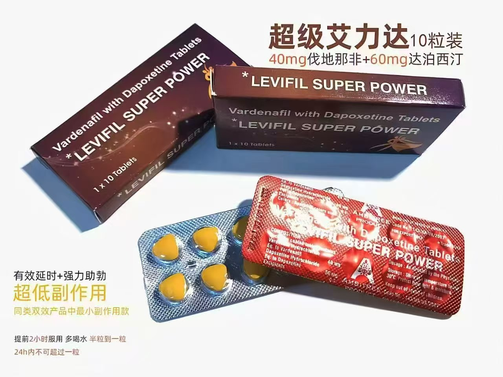
  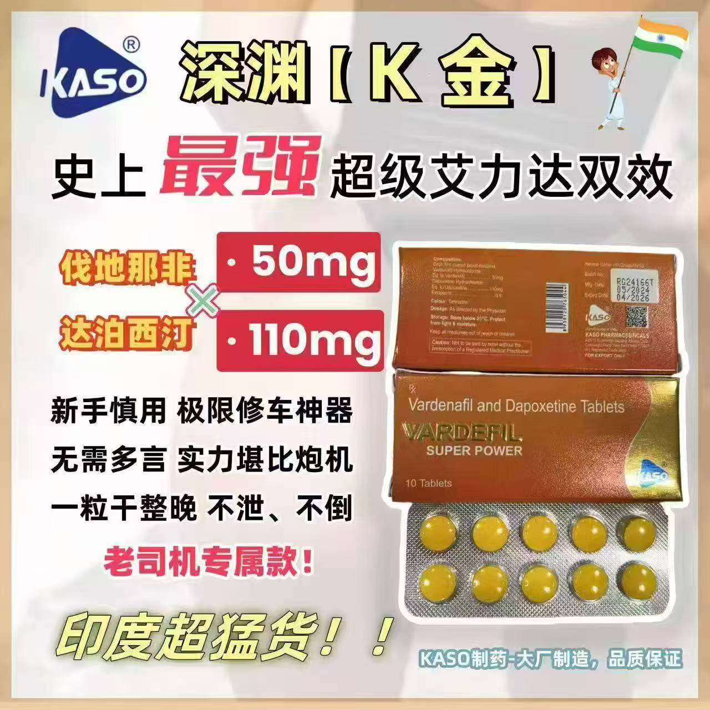
  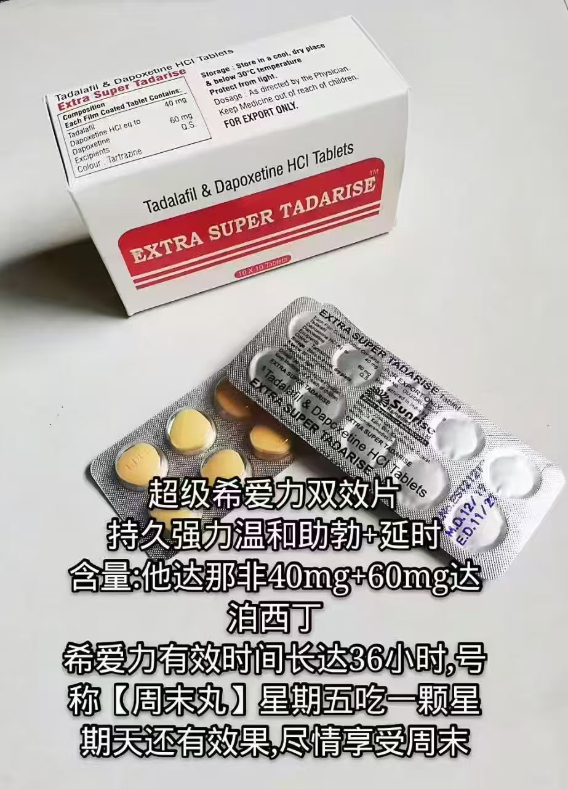
  
  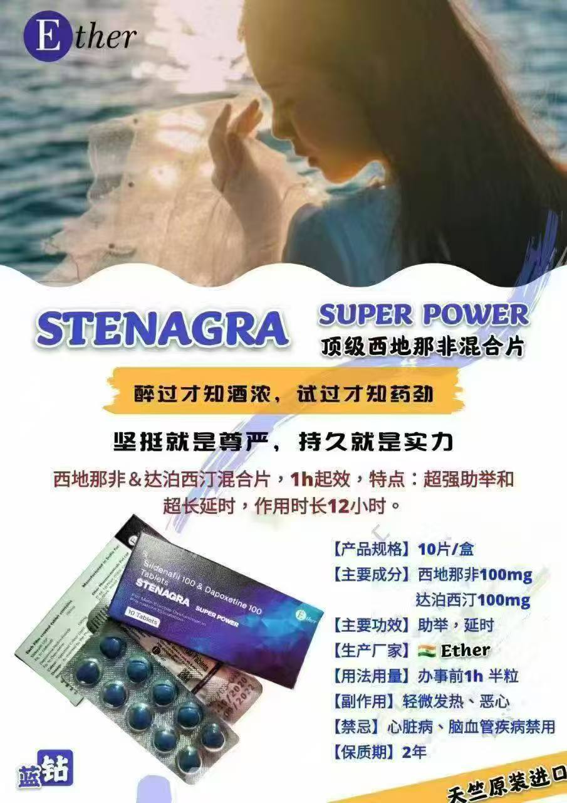
</p>
<p align="center">
  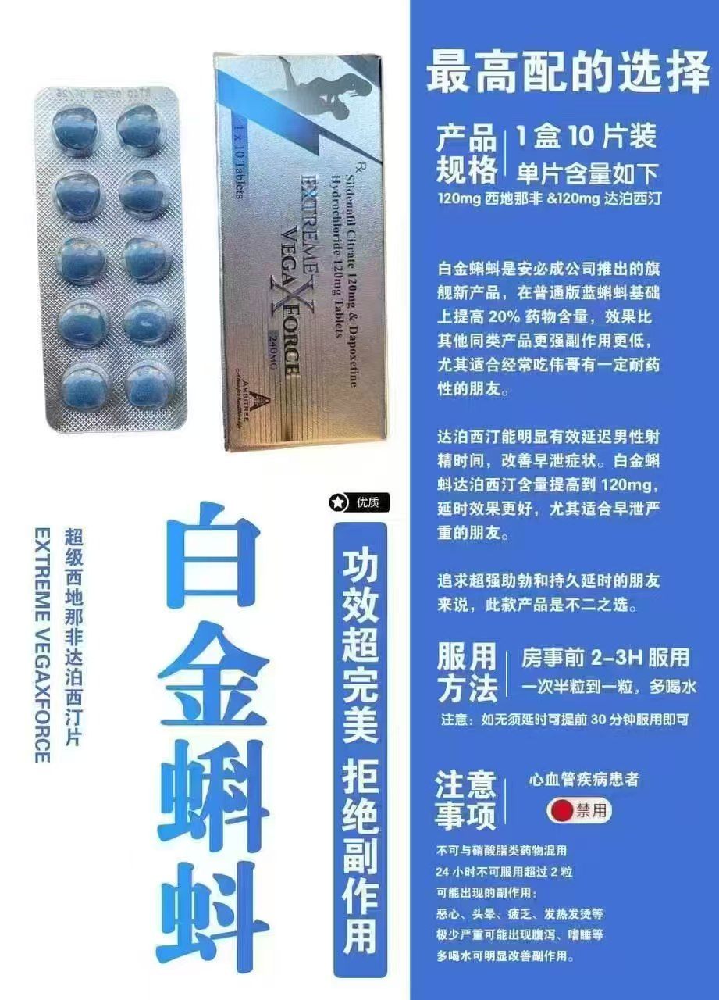
  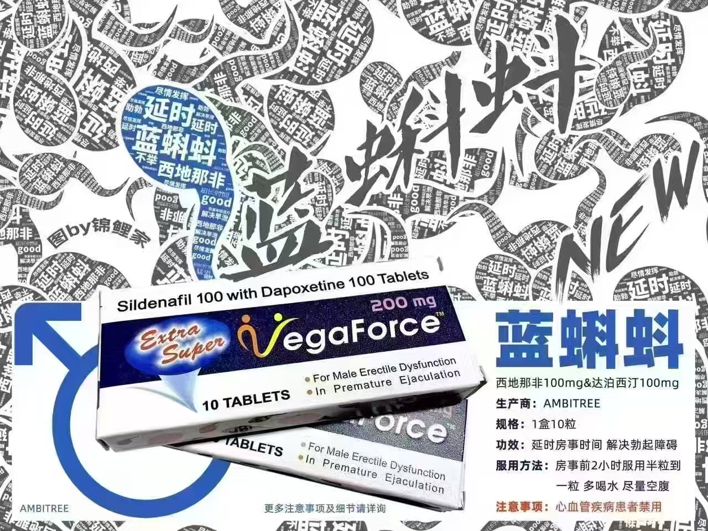
  
  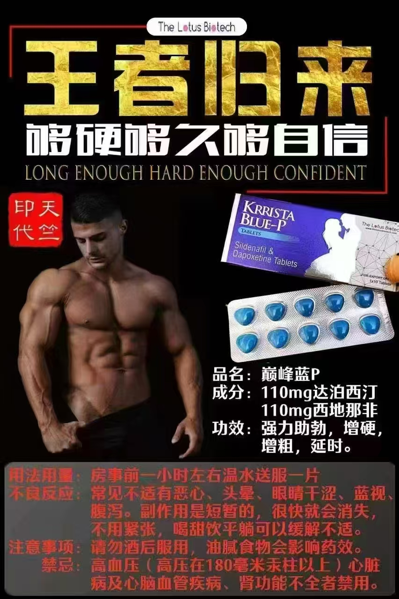
  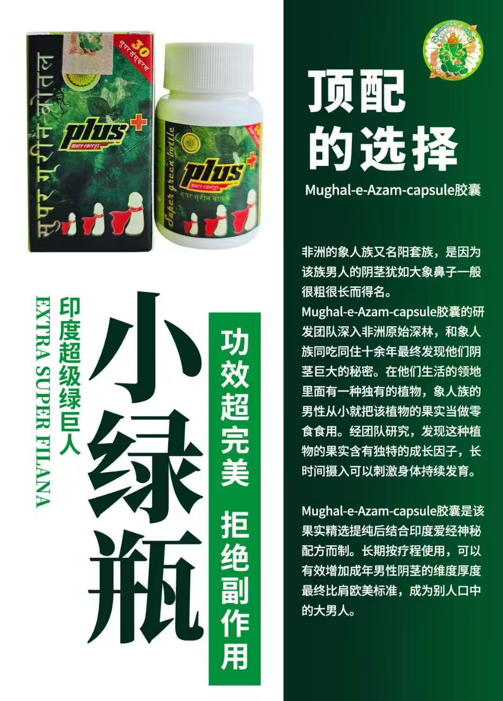
</p>

### 单效ED治疗药物（PDE5抑制剂）

**原研药品牌**:
| 产品名称 | 主要成分 | 俗称 | 特点 |
|----------|----------|------|------|
| [万艾可](./产品介绍/双效产品/万艾可伟哥.md) | 西地那非100mg | 伟哥、菱形 | 经典强效 |

### 单效PE治疗药物（SSRI类）

| 产品名称 | 主要成分 | 俗称 | 说明 |
|----------|----------|------|------|
| 必利劲 | 达泊西汀60mg | Priligy | SSRI类延时药物 |


### 双效产品系列

| 产品名称 | 成分组合 | 俗称 | 文档链接 |
|----------|----------|------|----------|
| [希爱力复方](./产品介绍/双效产品/希爱力.md) | 他达拉非20mg+达泊西汀60mg | 周末丸复方 | [详细说明](./产品介绍/双效产品/希爱力.md) |
| [艾力达复方](./产品介绍/双效产品/超级艾力达.md) | 伐地那非20mg+达泊西汀60mg | 橙色双效 | [详细说明](./产品介绍/双效产品/超级艾力达.md) |
| [Super Kamagra](./产品介绍/双效产品/巅峰蓝P.md) | 西地那非100mg+达泊西汀60mg | 巅峰蓝P | [详细说明](./产品介绍/双效产品/巅峰蓝P.md) |
| [Super P-Force](./产品介绍/双效产品/红魔绿水鬼.md) | 西地那非100mg+达泊西汀60mg | 红魔、黑水鬼 | [详细说明](./产品介绍/双效产品/红魔绿水鬼.md) |
| [Super Tadarise](./产品介绍/双效产品/超级希爱力.md) | 他达拉非20mg+达泊西汀60mg | 金钻复方 | [详细说明](./产品介绍/双效产品/超级希爱力.md) |
| [Super Vilitra](./产品介绍/双效产品/绿水鬼.md) | 伐地那非20mg+达泊西汀60mg | 绿水鬼 | [详细说明](./产品介绍/双效产品/绿水鬼.md) |
| [Extra Super Zhewitra](./产品介绍/双效产品/绿水鬼.md) | 伐地那非40mg+达泊西汀60mg | 加强版绿水鬼 | [详细说明](./产品介绍/双效产品/绿水鬼.md) |
| [西地那非仿制药](./产品介绍/双效产品/菱形白金蝌蚪.md) | 西地那非100mg | 菱形、白金蝌蚪 | [详细说明](./产品介绍/双效产品/菱形白金蝌蚪.md) |
| [伐地那非仿制药](./产品介绍/双效产品/绿P.md) | 伐地那非20mg | 绿P、绿蝌蚪 | [详细说明](./产品介绍/双效产品/绿P.md) |
| [他达拉非仿制药](./产品介绍/双效产品/金钻.md) | 他达拉非20mg | 金钻、黄片 | [详细说明](./产品介绍/双效产品/金钻.md) |
| [卡玛格拉口服果冻](./产品介绍/双效产品/印度果冻.md) | 西地那非100mg | 水果味果冻 | [详细说明](./产品介绍/双效产品/印度果冻.md) |
---

## 自然康复方法

我们特别强调**自然康复方法**的重要性：

### 运动康复
- **有氧训练**: 跑步、游泳、骑行提升心血管功能
- **力量训练**: 深蹲、硬拉、臀桥增强核心力量
- **盆底肌训练**: Kegel运动改善射精控制

### 营养优化
- **关键营养素**: 精氨酸、锌、维生素D
- **推荐食物**: 坚果、深海鱼、绿叶蔬菜
- **避免食物**: 高糖、高盐、反式脂肪

### 生活方式
- **优质睡眠**: 7-9小时充足睡眠支持激素分泌
- **压力管理**: 冥想、深呼吸、放松训练
- **戒烟限酒**: 改善血管功能和整体健康

[查看完整自然康复指南](./注意事项/男性性功能自然恢复方法指南.md)

---

## 快速查找

| 如果您听说过... | 对应产品 | 查看详情 |
|----------------|----------|----------|
| 伟哥、菱形、蓝色小药丸 | 万艾可 (西地那非) | [点击查看](./产品介绍/双效产品/万艾可伟哥.md) |
| 周末丸、希爱力 | 希爱力 (他达拉非) | [点击查看](./产品介绍/双效产品/希爱力.md) |
| 橙色药片、艾力达 | 艾力达 (伐地那非) | [点击查看](./产品介绍/双效产品/超级艾力达.md) |
| 白金蝌蚪、白菱形 | 西地那非仿制药 | [点击查看](./产品介绍/双效产品/菱形白金蝌蚪.md) |
| 绿P、绿蝌蚪 | 伐地那非仿制药 | [点击查看](./产品介绍/双效产品/绿P.md) |
| 金钻、黄片 | 他达拉非仿制药 | [点击查看](./产品介绍/双效产品/金钻.md) |
| 水果味果冻 | 卡玛格拉口服果冻 | [点击查看](./产品介绍/双效产品/印度果冻.md) |
| 巅峰蓝P | Super Kamagra | [点击查看](./产品介绍/双效产品/巅峰蓝P.md) |
| 红魔、黑水鬼 | Super P-Force | [点击查看](./产品介绍/双效产品/红魔绿水鬼.md) |
| 金钻复方 | Super Tadarise | [点击查看](./产品介绍/双效产品/超级希爱力.md) |
| 绿水鬼 | Super Vilitra | [点击查看](./产品介绍/双效产品/绿水鬼.md) |
| 加强版绿水鬼 | Extra Super Zhewitra | [点击查看](./产品介绍/双效产品/绿水鬼.md) |

---

## 安全使用指南

### 绝对禁忌
- **硝酸酯类药物使用者**: 严禁同时使用PDE5抑制剂
- **严重心血管疾病患者**: 需要专业心血管风险评估
- **严重肝肾功能不全**: 禁止使用相关药物

### 紧急情况处理
如出现以下情况请立即就医：
- 勃起持续超过4小时且疼痛
- 突然严重的视力或听力丧失
- 胸痛、心悸或呼吸困难
- 严重过敏反应（皮疹、肿胀等）

[查看完整安全指南](./注意事项/安全使用指南.md)

---

## 实用资源中心

除了产品知识，我们提供全面的自我提升资源：

### 🏋️ 运动与技巧

| 资源 | 说明 | 链接 |
|------|------|------|
| 凯格尔运动指南 | 盆底肌训练，改善控制能力 | [查看](./学习资源/技巧/凯格尔运动完整指南.md) |
| 延时训练技巧 | 动-停法、挤压法等科学方法 | [查看](./学习资源/技巧/延时训练技巧完整指南.md) |
| 运动健身指南 | 深蹲、跑步、力量训练 | [查看](./学习资源/技巧/男性健康运动指南.md) |

### 🌿 饮食与中医

| 资源 | 说明 | 链接 |
|------|------|------|
| 饮食营养指南 | 现代营养学调理方案 | [查看](./学习资源/技巧/饮食营养与中医养生指南.md) |
| 补肾中药指南 | 19种中药详解与配伍 | [查看](./学习资源/技巧/补肾中药完整指南.md) |

### 💬 沟通与心理

| 资源 | 说明 | 链接 |
|------|------|------|
| 两性沟通技巧 | 积极倾听、非暴力沟通 | [查看](./学习资源/沟通/两性沟通技巧指南.md) |
| 亲密技巧指南 | 前戏、情感连接、和谐之道 | [查看](./学习资源/沟通/两性和谐与亲密技巧指南.md) |
| 自信心建设 | 克服焦虑、建立自信 | [查看](./学习资源/沟通/自信心建设与性焦虑克服指南.md) |
| 情商提升 | 情绪管理、同理心培养 | [查看](./学习资源/沟通/情商提升指南.md) |
| 单身自我提升 | 独处成长、能力提升 | [查看](./学习资源/沟通/单身期自我提升与心理成长指南.md) |

### 📚 更多资源

| 资源 | 说明 | 链接 |
|------|------|------|
| PDF电子书库 | 推荐书单与学习资料 | [查看](./学习资源/学习资料/) |


---

## 联系方式

如有疑问或需要咨询，欢迎通过以下方式联系：

| 联系方式 | 账号/号码 | 说明 |
|---------|----------|------|
| **QQ** | 168880150 | 扫码或搜索QQ号添加 |
| **微信** | lemlem2348 | 扫码或搜索微信号添加 |
| **Telegram** | @ggbondbond | 点击用户名直接联系 |

### 二维码

<p align="center">
  
  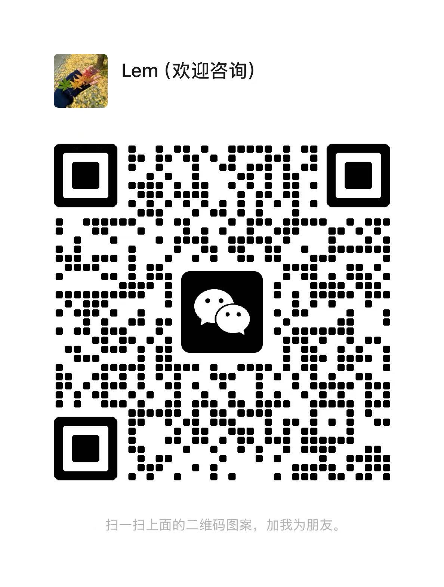
  
</p>

> 💬 **咨询说明**：本知识库仅供教育学习，如需专业医疗建议，请咨询正规医疗机构。

---

## 贡献指南

我们欢迎专业人士贡献高质量内容：

**欢迎的贡献类型**:
- 提供科学准确的医学信息
- 改进内容的清晰度和可读性
- 添加重要的安全警示信息
- 翻译内容到其他语言

**贡献要求**:
- 具有医疗、药学或相关专业背景
- 所有信息需有可靠的科学文献支撑
- 保持客观中立，避免商业倾向

---

## 免责声明

1. **教育目的**: 本知识库仅用于健康教育，不构成医疗建议
2. **专业咨询**: 任何治疗决定都应在专业医疗人员指导下进行
3. **信息准确性**: 我们努力确保信息准确，但医学知识不断发展更新
4. **个体差异**: 治疗效果因个体体质和病情而异
5. **法律合规**: 用户应遵守所在地区的相关法律法规

## 法律声明

本项目**绝对不会**：
- 销售或推广任何药物产品
- 提供个性化的医疗处方建议
- 认可或推荐任何特定品牌或供应商
- 鼓励自行用药或绕过医疗监管

---

## 许可证

本作品采用 CC BY-NC-SA 4.0 许可证。如需商业使用，请联系维护者。

---

## 📬 联系方式

如有任何问题或建议，欢迎通过以下方式联系：

<p align="center">
  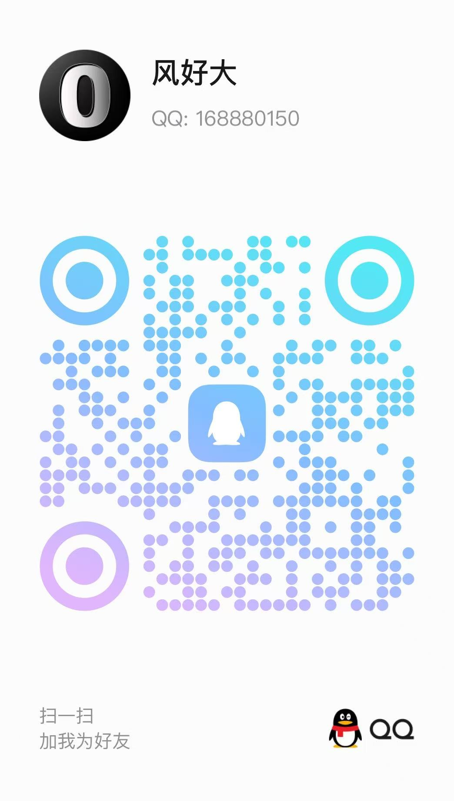
  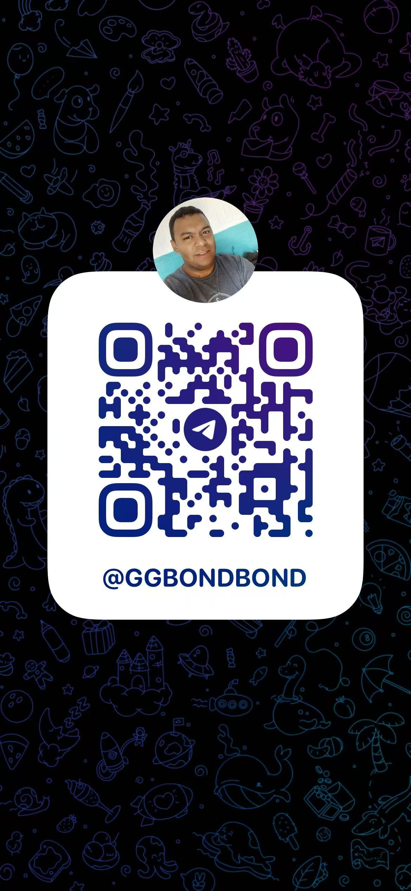
  
</p>

---

*本项目持续更新中，欢迎 Star 和 Fork*
